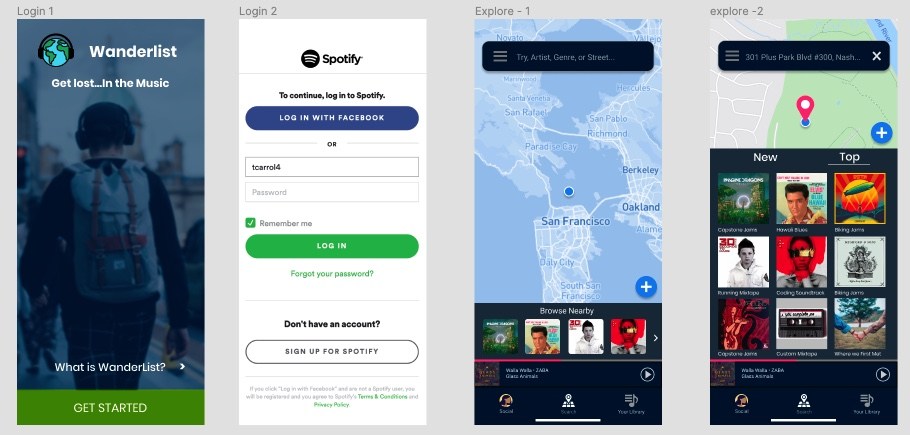

# This is WanderList.

WanderList is an application that allows you to search for and add playlists to a map.
Pin you and your partner’s favorite song to the coffee shop where you first met.
Create the perfect soundtrack to a hiking adventure.
Discover a city’s musical tastes.

## Problem:

With the rise of online music playing applications, users can have access to music from anywhere at the touch of a button on their phone. The trade-off is that regional and local musical context becomes an afterthought. For travelers, they might want to explore another facet of the local culture in a city or country. For audiophiles, they remember where they first got chills listening to their favorite music but keeping track of every song in that context can be hard to manage. For runners and cyclists, they might want the perfect sountrack to their favorite trail.

## Challenge Statement:

"How might we provide a platform where users can explore local musical tastes and provide location-specific soundtracks?"

## User Research:

I conducted an online survey using TypeForm and in-person interviews to get a better understanding of what tech users are already familiar with, and how they might think of music in the context of location. The quantitative research allowed me to be confident in where to draw my inspiration from in terms of how the user expect to use an app like Wanderlist.

### TypeForm Survey:
https://taylorcarroll997086.typeform.com/to/f2sfPv

## User Persona:

Below is the User Persona that condenses my research into a typical user (Sonya) that would use Wanderlist. I found that Sonya was very mobile-savy, mostly familiar with Google Maps, Instagram, and Spotify. Based on this evidence, I chose to create an application "mobile-first" in mind, and chose to draw inspiration from the previously mentioned applications, due to the user's familiarity with them.

## Lo-Fidelity Mockup and User Testing:

Below is my paper mockup of the Wanderlist. Some tweaks regarding where information architecture and additional views discovered at this stage.

## Hi-Fidelity Mockups and more User Testing:

These are some example views of the hi-fidelity mockup create in Figma. Users provided further valuable feedback regarding emphasizing what view the user was currently on, what was expected to be clickable on a given screen. This allowed me to begin building the application in React.

## Database Diagram:

I determined that while I will need to log users in my database, I chose not to require the user to create an account client side. I created logic that would check the local database for pre-existing users and post them only if Wanderlist could not find a matching spotify username.

## Content Map:

